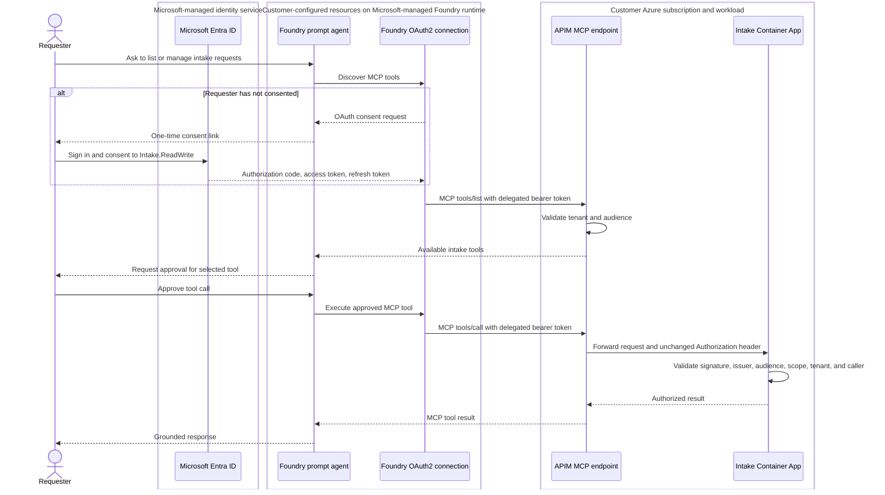
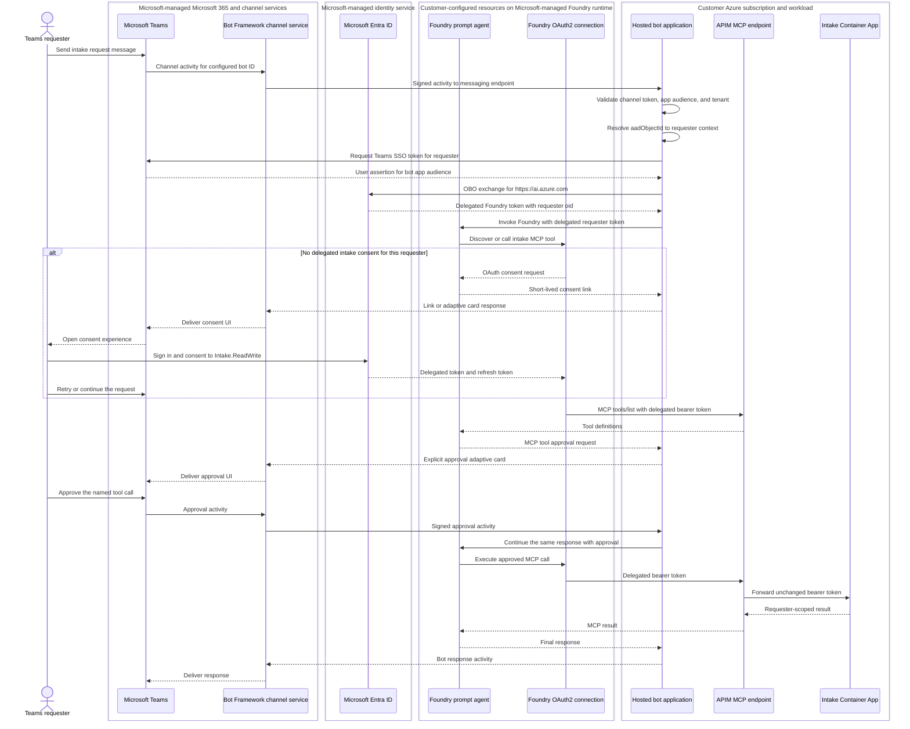

# Foundry MCP identity flow

This document describes the delegated Microsoft Entra identity flow from a
direct Foundry conversation or Microsoft Teams app to the Foundry prompt agent,
then through Azure API Management (APIM) to the intake API.

## Components

| Component | Responsibility |
| --- | --- |
| Requester | Signs in, grants delegated consent, and approves MCP tool calls |
| Teams client | Authenticates the requester to Microsoft 365 and renders agent messages, consent links, and approvals |
| Teams app package | Declares the bot application ID, scopes, permissions, and Teams installation metadata |
| Azure Bot resource and Bot Framework service | Registers the Teams channel and routes authenticated activities to the bot messaging endpoint |
| Bot application/channel adapter | Validates channel activities and maps the Teams user to the correct Foundry requester context |
| `prompt-intake-agent` | Selects an intake MCP tool and requests execution approval |
| Foundry OAuth2 project connection | Stores the confidential client credential and each requester's delegated token |
| Confidential OAuth client | Represents the Foundry connection during the authorization-code flow |
| Intake API app registration | Defines the API audience and delegated `Intake.ReadWrite` scope |
| APIM MCP endpoint | Validates the Entra token, rate limits the caller, and forwards the token |
| Intake Container App | Validates the token again and enforces scope, tenant, and record ownership |

The confidential OAuth client and intake API resource registration are separate
applications. The client secret belongs only in the Foundry project connection.
It must not be stored in source control, `.env`, an azd environment, or logs.

## Current deployment identifiers

Application and tenant IDs are identifiers, not credentials. Client secrets,
authorization codes, access tokens, and refresh tokens remain sensitive.

| Identifier | Current value | Purpose |
| --- | --- | --- |
| Entra tenant ID | `c214aaa8-7a43-441a-b501-f942c96f54a8` | Tenant accepted by APIM and the intake API |
| Intake API application ID | `09ff0241-0547-4231-9496-67121269632b` | Resource application that exposes `Intake.ReadWrite` |
| Intake API application ID URI | `api://09ff0241-0547-4231-9496-67121269632b` | Namespace used to request the API scope; retained as a compatible audience |
| Foundry OAuth client application ID | `931638a3-66d5-4ab5-9564-b1847201c9ca` | Confidential client used by the Foundry connection |
| Foundry connection name | `IntakeMCPServerOAuth` | Stores OAuth configuration and requester grants |
| Prompt agent name and version | `prompt-intake-agent`, version 5 | Agent that owns the approval-gated MCP tool |
| Teams app application ID | Not defined in this repository | Must be supplied by the Teams app registration |
| Requester object ID | Per signed-in user | Stable `oid`/`aadObjectId` used for ownership |

## Token and identifier matrix

| Hop or artifact | Token issuer | Expected `aud` | Important IDs and claims | Component action |
| --- | --- | --- | --- | --- |
| Teams activity through Bot Framework | Microsoft/Bot Framework channel | Configured Azure Bot application ID | Tenant ID and `from.aadObjectId` | Azure Bot routes it; the hosted bot validates it with the supported channel SDK |
| Teams SSO user assertion | Microsoft Entra ID | Teams/bot app application ID or URI | Requester `tid` and `oid`; client is the Teams/bot app | Hosted bot uses it as the user assertion for OBO; do not forward it to Foundry or APIM |
| Hosted bot to Foundry | Microsoft Entra ID OBO exchange | Foundry resource, normally `https://ai.azure.com` | Same requester `tid` and `oid`; `azp`/`appid` identifies the bot app | Invoke Foundry with the delegated requester token; requester needs Foundry Agent Consumer |
| OAuth authorization request | No bearer token yet | Not applicable | `client_id=931638a3-66d5-4ab5-9564-b1847201c9ca`, redirect URI, requested scopes | Entra authenticates the requester and records delegated consent |
| OAuth authorization code | Microsoft Entra ID | Confidential OAuth client | Short-lived, single-use code bound to client and redirect URI | Foundry connection redeems it; never expose or persist it |
| Intake delegated access token | Microsoft Entra ID | Normally `09ff0241-0547-4231-9496-67121269632b` for this v2 API; `api://09ff0241-0547-4231-9496-67121269632b` is also accepted for compatibility | `tid=c214...`, requester `oid`, `scp=Intake.ReadWrite`, client `azp=931638a3...` for v2 tokens | Foundry sends it to APIM; APIM and ACA validate it |
| Intake refresh token | Microsoft Entra ID | OAuth client/token endpoint context | Bound to requester, client, tenant, and consent | Foundry connection stores and uses it to renew access; never forward to APIM |
| APIM to ACA | Microsoft Entra ID | Same intake API audience as above | Same `tid`, `oid`, `scp`, and `azp`; token is unchanged | APIM forwards the original `Authorization` header |
| ACA to Cosmos DB | Microsoft Entra ID | Cosmos DB, requested with `https://cosmos.azure.com/.default` | ACA managed-identity object/client ID and Cosmos RBAC roles | Cosmos SDK obtains a separate managed-identity token; requester token is not reused |
| MCP approval response | Not an access token | Not applicable | Foundry response ID and one-time approval request ID | Continue only the matching response and approved tool call |

For the intake token, `aud` identifies the **resource API**, while `azp`
(v2) or `appid` (v1) identifies the **client application** that requested the
token. The requester is identified by `oid`; `sub` is accepted only as a
fallback when `oid` is unavailable. APIM and ACA authorize the resource
audience and requester scope, not the Teams display identity.

The current implementation does not restrict `azp` to one client because other
approved clients can legitimately call the intake API. If policy changes to
allow only the Foundry connection, both APIM and ACA must enforce
`azp=931638a3-66d5-4ab5-9564-b1847201c9ca` in the same change.

## End-to-end flow



Consent is per requester, Foundry project, and project connection. Tool
approval is separate from OAuth consent and is required for every invocation
because the prompt-agent MCP tool uses `require_approval: always`.

## Teams app flow

The Teams channel adds an identity boundary before the Foundry flow. Teams
authentication identifies who sent the activity, but it does not automatically
produce an access token for the intake API audience.



### Teams identity boundary

The diagram uses these ownership and execution boundaries:

| Boundary | Components | Responsibility |
| --- | --- | --- |
| Microsoft-managed SaaS and shared services | Teams client/service, Bot Framework channel service, Microsoft Entra ID | Operated by Microsoft; authenticates users and channel traffic and routes activities |
| Customer-configured resources on a Microsoft-managed runtime | Foundry project, prompt agent, OAuth2 project connection | Created and governed in the customer's Azure tenant/subscription, while Microsoft operates the service runtime |
| Customer Azure subscription and workload | Azure Bot registration, hosted bot application, APIM, Container App, Cosmos DB, identities, RBAC, and network controls | Provisioned and configured by the customer; application code and authorization policy are customer responsibility |

The Azure Bot resource itself is a customer-owned Azure configuration resource.
Its Teams channel uses the Microsoft-managed Bot Framework routing service.
The Azure Bot resource is not the application runtime and does not call Foundry
or APIM itself. The customer-hosted bot application owns the messaging endpoint
and must:

- Validate the Bot Framework or Microsoft 365 channel token before trusting an
  activity.
- Require the expected tenant and use the activity's Entra object ID, such as
  `from.aadObjectId`, as the stable requester identifier.
- Obtain a Teams SSO token for that user and use it as the assertion in a
  Microsoft Entra on-behalf-of exchange for the Foundry audience
  `https://ai.azure.com`.
- Invoke the Foundry Responses API with the resulting delegated user token, not
  with the bot's managed identity or app-only token. The user needs at least
  **Foundry Agent Consumer** on the project.
- Keep the same requester identity when starting and continuing the Foundry
  conversation, OAuth consent, and MCP approval flow.
- Treat display name, email address, conversation ID, and Teams user ID as
  context, not as authorization claims.
- Render the Foundry consent URL immediately because it is short-lived and
  single-use.
- Render the MCP approval request with the tool name and arguments and continue
  the same Foundry response only after the requester approves it.

The Teams channel token, bot token, and any Teams SSO token must not be
forwarded to APIM as the intake bearer token. The Teams SSO token is exchanged
for a Foundry user token. Foundry then uses the OAuth2 project connection to
acquire a separate token for the intake API audience with
`scp=Intake.ReadWrite`.

`from.aadObjectId` by itself does not pass identity to Foundry. It is an
identifier used to correlate the activity with the user. The cryptographic
identity reaching Foundry is the delegated OBO token:

```text
Teams user session
  -> Teams SSO assertion (audience: bot app)
  -> Entra OBO exchange
  -> Foundry user token (audience: https://ai.azure.com, oid: Teams user)
  -> Foundry OAuth connection
  -> Intake API token (audience: intake API, oid: same user)
```

If the bot invokes Foundry with its managed identity or client-credentials
token, Foundry sees the bot application as the caller. Passing
`aadObjectId` as message metadata does not convert that app-only call into a
delegated user call and must not be used as an authorization substitute.

With the correct OBO flow, Foundry does not see "the bot with a user `oid`."
It receives a delegated user token: `oid` identifies the requester and
`azp`/`appid` identifies the bot application that requested the token on the
user's behalf. Both identities are meaningful, but authorization remains
delegated to the user. With client credentials or managed identity, there is
no delegated user `oid`; the caller is the bot or service principal.

The custom bridge described above applies when Teams must invoke the
`prompt-intake-agent` or another runtime that doesn't expose Foundry's native
Activity endpoint. The hosted `maf-poc-agent` uses a different, simpler path:

```text
Teams or Microsoft 365 Copilot
  -> Microsoft Bot Channel Adapter
  -> existing Azure Bot Service registration
  -> Foundry stable Activity endpoint
  -> hosted ResponsesHostServer agent
  -> Foundry Toolbox and OAuth2 connection
  -> APIM
  -> intake API
```

For the hosted path, Foundry validates and authorizes Bot Service traffic. The
stable endpoint retains `responses` plus `Entra` for portal, SDK, CLI, and
evaluation callers, and adds `activity` plus `BotServiceTenant` for
organization-wide Teams use. The container continues to run
`ResponsesHostServer`; a second customer-hosted Bot Framework application is
not required.

The repository references an existing Azure Bot Service and Teams channel. It
does not create either resource, and it does not broaden the Foundry account's
selected-network rules. Secure Bot Channel Adapter reachability to the Activity
endpoint is an externally managed prerequisite.

The prompt agent still cannot be invoked directly through this hosted-agent
Activity endpoint. A Teams integration that specifically targets
`prompt-intake-agent` needs the custom bridge:

```text
Teams app package
  -> Teams channel
  -> [Microsoft managed] Bot Framework channel service
  -> [Customer Azure] Azure Bot registration and hosted bot messaging endpoint
  -> [Microsoft-managed runtime, customer configured] Foundry prompt agent
  -> [Microsoft-managed runtime, customer configured] Foundry OAuth2 connection
  -> [Customer Azure] APIM
  -> [Customer Azure] intake API
```

## Entra registrations

### Intake API resource application

The intake API registration defines:

- Application ID URI: `api://<intake-api-application-id>`
- Delegated permission: `Intake.ReadWrite`
- Application roles: `Intake.Read.All` and `Intake.ReadWrite.All`
- Single-tenant access

Delegated requester tokens must contain:

```text
tid=<configured tenant ID>
scp=Intake.ReadWrite
oid=<requester object ID>
```

The two formats identify the same resource application but have different
roles:

- `api://09ff0241-0547-4231-9496-67121269632b` is the **Application ID URI**.
  It namespaces the delegated scope requested as
  `api://09ff0241-0547-4231-9496-67121269632b/Intake.ReadWrite`.
- `09ff0241-0547-4231-9496-67121269632b` is the application's **client ID**.
  Because this resource registration requests v2 access tokens, this GUID is
  the normal `aud` claim in the issued token.

APIM and the intake API accept both equivalent values for compatibility with
tokens or clients using the Application ID URI audience. They do not accept an
unrelated audience. Accepting both does not grant access to another
application: both values resolve to this same intake API registration.

### Foundry confidential client

Use a dedicated single-tenant confidential web client for the Foundry
connection:

- Add delegated access to the intake API's `Intake.ReadWrite` scope.
- Create a time-bounded client secret.
- Register the exact redirect URI generated by the Foundry connection.
- Request `api://<intake-api-application-id>/Intake.ReadWrite` and
  `offline_access`.

The generated redirect URI has this form:

```text
https://global.consent.azure-apim.net/redirect/<connection-id>
```

The value is unique to the project connection. Read it from
`properties.redirectUrl`; do not guess or copy it from another connection.

## Foundry project connection

The prompt agent references a `RemoteTool` connection with:

| Setting | Value |
| --- | --- |
| Authentication type | OAuth2 |
| Target | `AZURE_INTAKE_MCP_SERVER_URL` |
| Authorization endpoint | Tenant-specific Entra v2 `/authorize` endpoint |
| Token and refresh endpoint | Tenant-specific Entra v2 `/token` endpoint |
| Scopes | `Intake.ReadWrite` and `offline_access` |
| Prompt-agent reference | `FOUNDRY_INTAKE_MCP_CONNECTION_ID` |

The operator managing the connection and prompt agent needs **Foundry User** at
the project scope.

## Validation boundaries

APIM and the intake API validate the same bearer token independently.

### Component responsibilities

| Component | Performs | Must not perform |
| --- | --- | --- |
| Teams client | Authenticates the Microsoft 365 session and presents consent and approval UI | Decide API authorization from display name, email, or Teams user ID |
| Teams app package | Associates the Teams installation with the configured bot application ID and permissions | Host runtime logic or store OAuth connection secrets |
| Azure Bot/Bot Framework service | Registers the Teams channel and routes activities between Teams and the messaging endpoint | Act as the intake requester or call APIM directly |
| Hosted bot application | Validates channel tokens, obtains the Teams SSO assertion, performs OBO for a delegated Foundry token, and preserves the requester `oid` | Invoke Foundry app-only when requester-scoped MCP access is required, or forward Teams tokens to APIM |
| Foundry prompt agent | Chooses an allowed tool and generates an MCP approval request | Execute an approval-gated tool before requester approval |
| Foundry OAuth2 connection | Runs authorization-code consent, stores delegated grants, refreshes tokens, and attaches the intake token | Expose client secrets, refresh tokens, or authorization codes |
| Microsoft Entra ID | Authenticates the requester and issues tokens for the requested resource and scopes | Grant an unconfigured audience or scope |
| APIM | Validates tenant and audience, rate limits, maps MCP tools to REST operations, and forwards the unchanged bearer token | Replace requester identity or weaken ACA authorization |
| Intake Container App | Revalidates the token and enforces scope, roles, tenant, ownership, and request rules | Trust APIM alone or accept caller-selected tenant/creator IDs |
| Cosmos DB | Authorizes the ACA managed identity and stores tenant-partitioned records | Receive or authorize the requester bearer token |

### APIM checks

- Requires an `Authorization: Bearer` header.
- Validates the configured tenant.
- Accepts the API URI and equivalent client-ID audiences.
- Rate limits by authenticated token.
- Forwards the unchanged `Authorization` header.

### Intake API checks

- Validates the RS256 signature against tenant JWKS.
- Validates issuer, lifetime, tenant, and audience.
- Requires `scp=Intake.ReadWrite` for delegated writes.
- Uses `tid` and `oid`/`sub` to enforce tenant and requester ownership.
- Does not allow request bodies to choose tenant or creator identity.

Application permissions use the configured `Intake.Read.All` and
`Intake.ReadWrite.All` roles instead of the delegated scope.

## Expected behavior

| Check | Expected result |
| --- | --- |
| First use before consent | `oauth_consent_request` |
| First Teams use before consent | Teams renders the current consent link for the same requester |
| Tool selected after consent | `mcp_approval_request` |
| Tool selected from Teams | Teams renders an explicit approval action and continues the same response |
| Approved `list_intake_requests` | MCP call succeeds and ACA returns HTTP 200 |
| Unauthenticated APIM MCP request | HTTP 401 |
| Direct public ACA request | HTTP 403 |
| Delegated token with wrong scope | HTTP 403 from the intake API |
| Token with wrong tenant or audience | HTTP 401 |

## Hosted-agent identity diagnostics

The Foundry hosted container does not receive the inbound OBO bearer token or
its `oid`, `azp`, `aud`, `scp`, or `tid` claims. The hosting platform validates
the request and exposes only request-scoped platform context:

- A global Foundry per-user ID for state isolation.
- An opaque Foundry call ID used to resolve delegated caller context for
  outbound Foundry services such as Toolbox.
- The hosted session ID when available.

Set `IDENTITY_DIAGNOSTICS_ENABLED=true` only for a controlled published-agent
test. Each agent run then emits a log similar to:

```text
foundry.identity_headers x-agent-user-id=sha256:<16 hex chars> x-agent-foundry-call-id=sha256:<16 hex chars> session_id=present
```

The values are truncated SHA-256 hashes of the platform-supplied header values.
They can confirm that repeated requests reached the hosted agent with the same
per-user context and distinguish request call contexts without exposing either
raw identifier. Presence of both headers confirms that the hosted runtime
received requester-scoped platform context and can forward the opaque call ID
to Foundry Toolbox.

This log cannot prove the exact Entra `oid`, `azp`, or `aud` because those
claims are intentionally not exposed to the container. Validate them at the
customer-hosted bot immediately after OBO token validation, without logging
the token, and validate the downstream intake token at APIM or the intake API.
The expected Teams OBO values are:

```text
aud=https://ai.azure.com
oid=<Teams requester object ID>
azp or appid=<Teams bot application ID>
```

Keep `IDENTITY_DIAGNOSTICS_ENABLED=false` after the test. Never log the raw
platform user ID, Teams object ID, bearer token, authorization code, refresh
token, prompt, response, or intake content.

## Troubleshooting

### `Code <id> not found` on the consent page

The consent link is short-lived and single-use. Invoke the agent again and open
the newly returned link immediately. Do not reuse a link from an earlier
response.

Also verify that the connection's current `properties.redirectUrl` is
registered exactly as a web redirect URI on the confidential client.

For Teams, do not cache the consent URL in conversation state or reuse an
adaptive card from an earlier turn. Replace it with the latest link returned
for that requester and connection.

### Teams user repeatedly receives consent

Confirm that the Teams app maps the same `aadObjectId` to the same Foundry
requester context on every turn. If the app invokes Foundry as its own service
identity or generates a new end-user context for each activity, Foundry cannot
reuse the requester's cached delegated grant.

Also confirm that the app continues the original Foundry response after MCP
approval rather than starting a new unrelated conversation.

### `424 Failed Dependency` with downstream `401`

Foundry obtained a token, but the customer-managed MCP endpoint rejected it.

1. Confirm the delegated grant exists for `Intake.ReadWrite`.
2. Confirm the client secret is current.
3. Confirm APIM accepts both `api://<application-id>` and `<application-id>`
   token audiences.
4. Check whether ACA received the request:
   - No ACA access log means APIM rejected the token.
   - An ACA HTTP 401 means the API rejected token validation.
   - An ACA HTTP 403 means identity validation succeeded but scope, role, or
     ownership authorization failed.

### `invalid_client`

The connection has the wrong or expired client secret. Create a new
time-bounded secret and update or recreate the Foundry connection. Never add a
key-based fallback to the application.

### Redirect URI mismatch

Read the redirect URI from the current connection ARM resource and replace the
confidential client's web redirect URI with that exact value. Redirect URIs are
connection-specific.

## Security invariants

- Keep the intake API and OAuth client single tenant.
- Keep the client secret only in the Foundry connection.
- Preserve explicit MCP tool approval.
- Validate Teams channel tokens and bind each activity to its Entra tenant and
  object ID.
- Never substitute a Teams bot, channel, or SSO token for the intake API token.
- Do not log prompts, responses, bearer tokens, connection secrets, or intake
  document content.
- Keep ACA ingress restricted to APIM's public IP.
- Keep unauthenticated APIM access rejected.
- Do not weaken Foundry, ACR, Cosmos DB, Search, or Storage network controls to
  troubleshoot OAuth.
